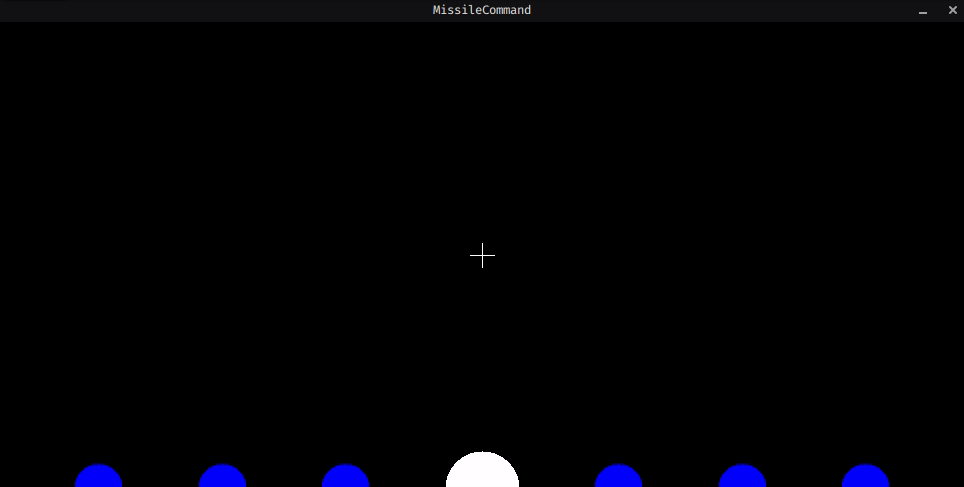

# gym_missile_command

Open AI Gym environment of the [Missile Command Atari game](https://en.wikipedia.org/wiki/Missile_Command).



Game
------------------------------------------

The player musts defend 6 cities from incoming enemy ballistic missiles.
To do so, he can fire missiles from an anti-missiles battery.
An episode ends when all enemy missiles or cities are destroyed.
This environment does not reproduce an exact version of the Missile Command Atari game but a simplified one.

- The anti-missiles battery can not be destroyed.
- There are no levels, all episodes have the same difficulty.
- Enemy missiles do not have an explosion radius and do not split.

The reward depends on several variables, each one contributing to a specific wanted skill of the agent.

- Number of cities destroyed, to protect the cities.
- Number of enemy missiles destroyed, to improve accuracy.
- Number of missiles launched, to minimize the use of missiles.

Installation
------------------------------------------

[Python](https://www.python.org/) 3.8+ is required.
The installation is done with the following commands.

```shell
git clone https://github.com/ElieKadoche/gym_missile_command.git
pip install -e ./gym_missile_command
```
Examples
------------------------------------------

For a human to play, commands are: arrow keys to move the target and space to fire a missile.

```shell
python -m gym_missile_command.examples.random_agent  # For a random agent to play
python -m gym_missile_command.examples.human_agent  # For a human to play
```

Usage
------------------------------------------

To see the whole customizable configuration, see [./gym_missile_command/config/config.py](./gym_missile_command/config/config.py).

```python
import gym

import gym_missile_command

# Custom configuration, empty for no changes
env_context = {"ENEMY_MISSILES.NUMBER": 42,
               "FRIENDLY_MISSILES.EXPLOSION_RADIUS": 17}

# Create the environment
env = gym.make("missile-command-v0", env_context=env_context)

# Reset it
observation = env.reset(seed=None)

# While the episode is not finished
done = False
while not done:

    # Select an action (here, a random one)
    action = env.action_space.sample()

    # One step forward
    observation, reward, done, _ = env.step(action)

    # Render (or not) the environment
    env.render()

# Close the environment
env.close()
```
